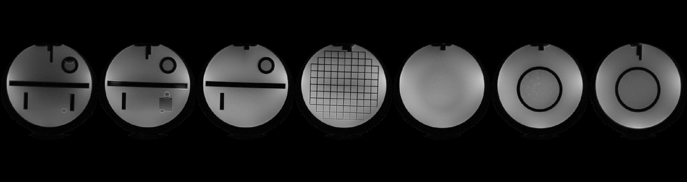

[](https://brain-to.github.io/GIRFReco)
[](https://codecov.io/gh/BRAIN-TO/GIRFReco.jl)
# GIRFReco.jl: An open-source pipeline for spiral MRI Reconstruction in Julia

## Introduction

This package provides an image reconstruction pipeline for real-world non-Cartesian MRI, especially on spiral diffusion imaging. It is completely implemented in Julia using original code and external packages, e.g., [MRIReco.jl](https://magneticresonanceimaging.github.io/MRIReco.jl/latest/) for the off-resonance (B<sub>0</sub>) corrections & core iterative reconstruction tasks, and [MRIGradients.jl](https://github.com/BRAIN-TO/MRIGradients.jl) for the correction of gradient waveforms due to system imperfections via the Gradient Impulse Response Function (GIRF).

This repository includes working [examples](./docs/lit/examples/) for spiral reconstruction with GIRF correction of trajectory (kx-ky-kz, or k<sub>1</sub> as the first order GIRF) and B<sub>0</sub> eddy currents (k<sub>0</sub> as zeroth order GIRF), iterative reconstruction (cg-SENSE) and a Cartesian reconstruction example for coil sensitivity and off-resonance map calculation.

The data for the phantom reconstruction [`joss_demo.jl`](./docs/lit/examples/joss_demo.jl) is publicly available [here](https://www.doi.org/10.5281/zenodo.7779045). The path of the data, `params_general[:project_path]`, needs to be modified accordingly in the [config file](./docs/lit/examples/recon_config_joss_demo.jl).

For a full introduction, please refer to our [manuscript](./paper/paper.md) for a full description of this package, including background, purpose, implementation, and the information of dependent packages.

## Quick Installation
To install the package, **type** the following command:
```
julia>]add GIRFReco
```

It is also possible to install the package with the following code:
```
using Pkg
Pkg.add("GIRFReco")
```

## Development Installation

1. To get started, make sure you have Julia installed (>=1.9).
2. Clone the GIRFReco.jl project from Github to a local directory by `git clone git@github:BRAIN-TO/GIRFReco.jl` or to copy it to the dev directory using the Quick Installation and the following command:
```
julia> ]dev GIRFReco
```
3. Open a Julia REPL under the path of your local `GIRFReco.jl` folder. Our own development configuration is Visual Studio Code with the Julia extension. Other environments for Julia should work in a similar way with possible extra configurations.
4. In the Julia REPL, type `]` to enter the package manager.
5. In Julia package manager, Type `activate .` to activate a the Julia environment defined in `Project.toml` file in the `GIRFReco.jl` repo.
6. Add the `MRIGradients.jl` package by `add MRIGradients`.
7. Install all additional dependent packages:
    * `add MRIReco`
    * `add MRIFiles`
    * `add MRIBase`
    * `add ImageUtils`
    * `add MRICoilSensitivities`
    * `add FileIO`
8. Use command `instantiate` in Julia package manager to install all of the dependencies. This may be all you need to do (i.e you might be able to skip steps 7,8). 
9. Download the demonstrating data from Zenodo (https://doi.org/10.5281/zenodo.6510020) and extract to your local folder. **Make sure you have both reading and writing privileges on the data folder.**
    * Note: The data downloading might take a few minutes.
10. Open the demo script `joss_demo.jl` under the folder `docs/lit/examples/`, make sure to set `rootProjPath` as the folder that stores demo data, then run it in Julia REPL.

## Example Results

1. **Phantom Images.** (*Presented at [ISMRM 2022, p.2435](https://archive.ismrm.org/2022/2435.html)*): using a dataset with 4 spiral interleaves for images with 1.1mm in-plane resolution. The code and dataset are both described in the [previous section](#quick-installation).

    ```bash
    cd docs/lit/examples
    julia joss_demo.jl
    ```

The final reconstructed spiral images are similar to the following ones:



2. **In-vivo Brain Image.** Below is a set of T2-weighted in-vivo spiral images reconstructed with both B0 and GIRF corrections using the scripts in this repo. We demonstrated the step-by-step improvement of GIRF and B0 corrections, respectively. Please note that the raw in-vivo data is not publically available due to REB restrictions.


