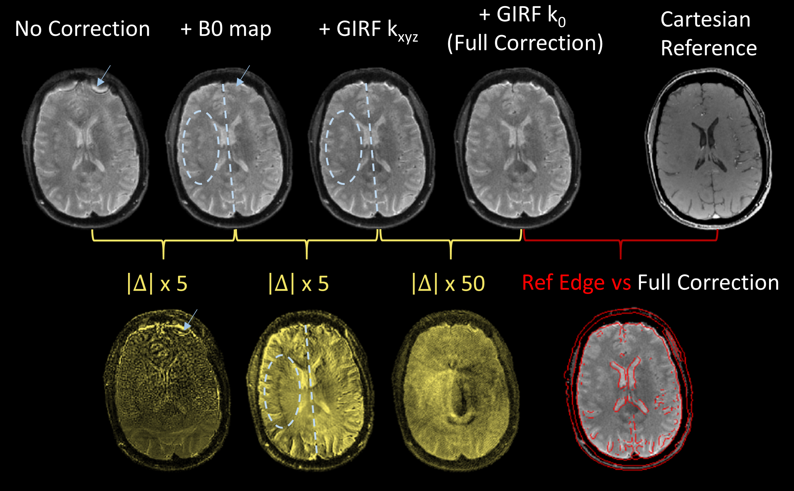

# Summary

Magnetic Resonance Imaging (MRI) acquires data in the frequency domain (k-space), with the sampling pattern traversed by a path known as the k-space trajectory. MRI exhibits a low intrinsic signal-to-noise ratio (SNR), making trajectories with high acquisition efficiency (i.e., high rate of measured samples per time) a desirable choice for sampling. Non-Cartesian trajectories in particular, such as spirals, which traverse k-space in longer readouts, instead of line-by-line, can offer considerable acceleration and improvement in SNR per unit time at the cost of reconstruction complexity, e.g., for diffusion-weighted MRI[@lee_signalnoise_2021].

The actual k-space trajectory applied during the MRI experiment can differ from the nominal trajectory due to hardware imperfections, resulting in image artifacts such as ghosting, blurring or geometric distortion. This problem is exacerbated in many non-Cartesian trajectories, including spiral readouts, because these fast imaging protocols place high demands on the gradient hardware of the MRI system [@block_spiral_2005]. To combat this, accurate characterization of the system hardware for k-space trajectory correction is necessary, for example via a gradient impulse response function (GIRF) [@vannesjo_gradient_2013]. 

Furthermore, acquisition can be additionally accelerated by acquiring a larger portion of k-space per excitation (single or few-interleave scanning), prolonging trajectory duration. However, the encoding of the object in frequency domain is susceptible to static off-resonance (or field inhomogeneity, B0), resulting in image artifacts that scale with readout duration. For non-Cartesian trajectories, these artifacts are difficult to correct in post-processing, but can be effectively addressed during image reconstruction by incorporating off-resonance maps into the signal model [@sutton_fast_2003].

Therefore, recent spiral imaging approaches often rely on an expanded signal model incorporating system imperfections and off-resonance maps [@wilm_higher_2011;@wilm_diffusion_2015;@vannesjo_image_2016], in combination with parallel imaging acceleration using multiple receiver coils and the respective iterative non-Cartesian image reconstruction algorithms (e.g., CG-SENSE [@pruessmann_advances_2001]).

Here, we introduce the software package `GIRFReco.jl`, which provides an open-source, single ecosystem implementation of this state-of-the-art approach to non-Cartesian MRI in the programming language Julia [@bezanson_julia_2017]). The core reconstruction routines rely upon `MRIReco.jl`, a comprehensive open-source image reconstruction toolbox also written in Julia. To enable robust, accessible and fast MRI with spiral gradient waveforms, `GIRFReco.jl` is designed as an end-to-end signal processing pipeline, from open-standard raw MR data ([ISMR]MRD [@inati_ismrm_2017]) to final reconstructed images (NIfTI neuroimage data format [@NIfTI]). It integrates system characterization information via GIRF correction for accurate representation of the encoding fields, relevant calibration data (coil sensitivity and static off-resonance maps) and non-Cartesian iterative parallel imaging reconstruction.

# Statement of Need

Existing open-source solutions for the correction of system imperfections and static off-resonance in MRI are often implemented within the framework of mature image reconstruction suites such as BART [@blumenthal_mrireconbart_2022], Gadgetron [@hansen_gadgetron_2013] or MRecon (https://www.gyrotools.com/gt/index.php/products/reconframe).

However, the aforementioned complexity of the image reconstruction task for spiral MRI currently necessitates the integration of tools from multiple of these software suites, in order to establish a performant and comprehensive image reconstruction workflow [@veldmann_opensource_2022]. With each tool being developed in different programming languages (C for BART, C++ for Gadgetron, MATLAB for MRecon, etc.), extending such an image reconstruction pipeline then requires cross-language expertise, adding significant overhead and complexity to development. This presents a significant barrier to efficient and reproducible image reconstruction and limits software accessibility and sustainability, especially for users without software engineering background.

The programming language Julia [@bezanson_julia_2017] provides a solution to this multiple-language problem by using a high-level interface to low-level compiled code, i.e., enabling fast prototyping with limited resources in an academic setting, while delivering performant execution times without code rewriting, all within a single developing environment.

In this work, we introduce `GIRFReco.jl` (initial version presented at the annual meeting of ISMRM 2022 [@jaffray_open-source_2022]), which implements an end-to-end, self-contained processing and image reconstruction pipeline for spiral MR data completely in Julia. Based on the established `MRIReco.jl` package, `GIRFReco.jl` incorporates model-based corrections [@sutton_fast_2003;@wilm_higher_2011;@wilm_diffusion_2015;@vannesjo_image_2016] to achieve high-quality spiral MRI reconstructions. Specifically, this reconstruction pipeline combines several major steps: (1) ESPIRiT coil sensitivity map estimation [@uecker_espirit-eigenvalue_2014]; (2) Robust off-resonance (B0) map estimation [@funai_regularized_2008;@lin_fessler_fieldmapestimation3d_2020]; (3) GIRF Correction to the theoretical non-Cartesian k-space trajectory [@vannesjo_gradient_2013;@vannesjo_image_2016]; (4) Iterative non-Cartesian MRI reconstruction with off-resonance correction [@pruessmann_advances_2001;@knopp_iterative_2009]. Considering software reusabulity and sustainability, (1) and (4) of the abovementioned steps are handled by `MRIReco.jl`, a comprehensive modular open-source image reconstruction toolbox in Julia. Step (2), the B0 map estimation, was developed as a Julia package `MRIFieldmaps.jl` by the original authors [@lin_fessler_fieldmapestimation3d_2020] with our contribution of implementing an alternative algorithm [@funai_regularized_2008] in Julia. Finally, we implemented step (3), the GIRF correction, in an original Julia package `MRIGradients.jl` (https://github.com/MRI-gradient) [@jaffray_open-source_2022], porting and refactoring the MATLAB code of the original authors [@vannesjo_girfmatlab_2020].

# Functionality

## Required Inputs

`GIRFReco.jl` requires raw MR (k-space) data (in [ISMR]MRD format [@inati_ismrm_2017]) of the following scans as input:

1. Multi-echo Gradient-echo spin-warp (Cartesian) scan
    - must include at least two echo times (e.g. 4.92 ms and 7.38 ms at 3T)
2. Spiral scan
    - single or multi-interleave

At the moment, the slice geometry (thickness, field-of-view, and direction) of the Cartesian and spiral scans must be congruent, however the resolution need not be identical or even isotropic.

## Overview of Components

The following components are utilized within the spiral reconstruction pipeline of `GIRFReco.jl` (Fig. 1), and called from their respective packages.

1. Core iterative image reconstruction, using Julia package `MRIReco.jl`
    a. CG-SENSE [@pruessmann_advances_2001] algorithm
    b. ESPIRiT [@uecker_espirit-eigenvalue_2014] for sensitivity maps
2. Model-based correction components
    a. Smoothed B0 map estimation, using an implementation of [@funai_regularized_2008;@lin_fessler_fieldmapestimation3d_2020] in `MRIFieldMaps.jl`
    b. Static B0 map correction, accelerated by time-segmented implementation [@knopp_iterative_2009] in `MRIReco.jl` [@knopp_mrirecojl_2021]
    c. Gradient impulse response function (GIRF) [@vannesjo_gradient_2013]
        - Measurement with a phantom-based technique [@graedel_comparison_2017]
        - Estimation using open-source code [@wu_mr_2022]
        - Prediction via original package `MRIGradients.jl` [@jaffray_open-source_2022]

*Figure 1. An overview of GIRFReco.jl components consists of the whole reconstruction pipeline.*

## Detailed Processing Pipeline

`GIRFReco.jl` executes the steps required for spiral diffusion reconstruction in the following order:

1. Conversion of proprietary, vendor-specific raw image data to an open-source raw data format ([ISMR]MRD, [@inati_ismrm_2017]
2. Synchronization of the data and the k-space trajectory onto a common timebase
3. Model-based correction of the k-space sampling points (linear gradient self-terms) and data (k0 eddy currents) using the gradient impulse response function (GIRF [@vannesjo_gradient_2013], `MRIGradients.jl`)
4. Coil sensitivity map estimation (ESPIRiT, [@uecker_espirit-eigenvalue_2014])
5. Off-resonance (B0) map estimation and processing (`MRIFieldmaps.jl`, [@funai_regularized_2008;@lin_fessler_fieldmapestimation3d_2020])
6. Non-Cartesian, iterative parallel image reconstruction with off-resonance correction (`MRIReco.jl`, [@knopp_mrirecojl_2021;@knopp_iterative_2009;@pruessmann_advances_2001])

*Figure 2. Reconstructed Multi-interleave spiral images on a phantom. All images without any correction, with B0 correction, B0 + GIRF corrections, and all corrections, together with their stepwise differences, are demonstrated.*

Via dedicated configuration files, individual steps can be selectively applied or skipped during reconstruction, enabling assessment of the impact of different model-based corrections on final image quality. We demonstrate this use case by example `GIRFReco.jl` pipeline results for reconstruction of a T2-weighted multi-interleave spiral acquisition of a phantom (Figure 2) and single-interleave in-vivo brain acquisitions (Figure 3). In both cases, improved image quality was obtained by successively increasing the complexity of the applied model-based corrections (nominal trajectory, added B0 correction, GIRF-correction of gradients, GIRF correction of k0 eddy currents).

*Figure 3. Reconstructed Multi-interleave spiral images on a human subject. All images without any correction, with B0 correction, B0 + GIRF corrections, and all corrections, together with their stepwise differences, are demonstrated. Cartesian image is used as the reference; its edges are extracted for quality-check purpose.*

Note that the reconstruction results from the phantom experiment (Figure 2) can be fully reproduced using `GIRFReco.jl` and the corresponding dataset, made publicly available [@jaffray_phantomdata_2022]. For details, see the "Getting Started" section below.

## Quality of Life Features

In addition to providing an end-to-end reconstruction workflow, `GIRFReco.jl` provides intermediate methods for plotting images and calibration data using PlotlyJS, as well as the capability to export intermediate reconstruction results such as calculated coil sensitivity maps and B0 maps to NIfTI, a common neuroimaging data format supported by various analysis and visualization packages [@NIfTI].

# Getting Started

Up-to-date information about how to install `GIRFReco.jl`, run example reconstructions (e.g., reproducing Figure 2) and apply it to your own data can be found in the README.md provided in the GitHub repository. Further technical documentation about the API, including the current feature set of `GIRFReco.jl`, is provided at https://brain-to.github.io/GIRFReco.jl, automatically generated by [`Documenter.jl`](https://github.com/JuliaDocs/Documenter.jl).

# Conclusion and Outlook

The presented pipeline, `GIRFReco.jl`, is an open-source end-to-end solution for spiral MRI reconstruction. It is developed in Julia, and allows users to obtain final images directly from raw MR data acquired by spiral k-space trajectories. Following best practices of software sustainability and accessibility, we rely on the established MR image reconstruction package `MRIReco.jl` in our package, while extending its capability to handle the more complex use case of multiple model-based corrections, necessary for high-quality spiral MRI. Besides spirals, `GIRFReco.jl` can be readily utilized for data acquired under arbitrary non-Cartesian k-space trajectories to enable model-based MRI reconstruction with GIRF and off-resonance corrections. Furthermore, `GIRFReco.jl` can be extended to handle additional model-based corrections (e.g., concomitant or higher-order encoding fields, [bernstein_concomitant_1998;@wilm_higher_2011;@wilm_diffusion_2015;@vannesjo_image_2016]), and act as a self-contained template for generalized image reconstruction from raw scan and calibration data to interpretable and accessible images. 

# References
