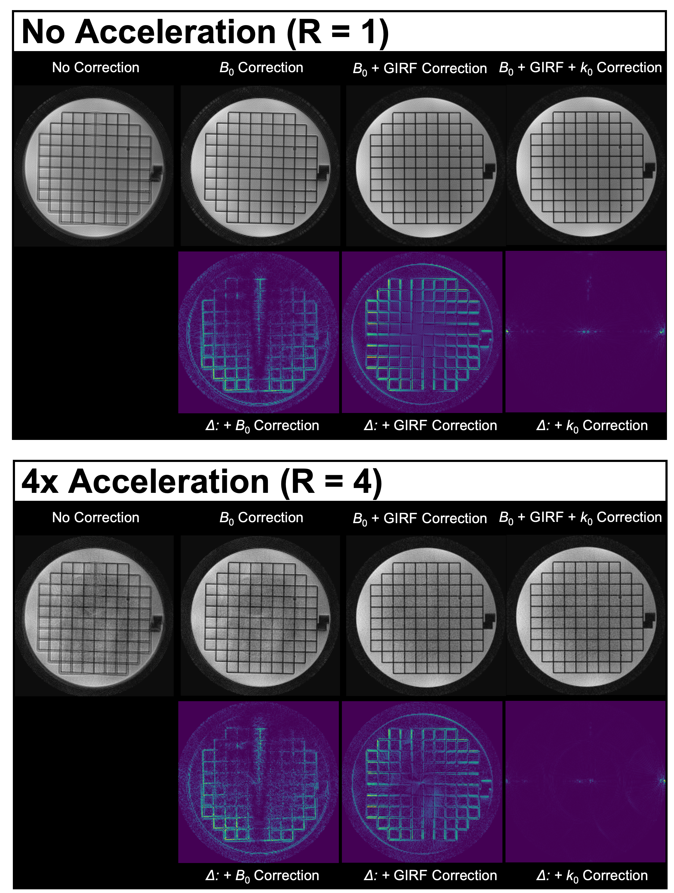

# Summary

Magnetic Resonance Imaging (MRI) acquires data in the frequency domain (k-space), with the sampling pattern traversed by a path known as the k-space trajectory. It is desirable to implement MRI data sampling using k-space trajectories with high acquisition efficiency (i.e., a fast coverage of k-space). Traditional Cartesian MRI traverses k-space by acquiring individual lines of the k-space, each requiring an excitation, a phase-encoding step, and a short readout gradient. However, it is possible to traverse k-space with an arbitrary trajectory, achieved by a long sequence of readout gradients, thus presenting the opportunity to acquire more sampling points per excitation. Spiral trajectories are a popular and efficient method for traversing k-space with a long readout, as well as classical echo-planar imaging (EPI) trajectories. Non-Cartesian trajectories, such as spiral trajectories, yield significant reductions in the number of excitations required for the acquisition of an image, thus offering considerable acceleration and improvements in signal-to-noise ratio (SNR) per unit time at the cost of reconstruction complexity. These improvements are particularly beneficial in diffusion MRI due to sequence timing constraints [@lee_signalnoise_2021].

The actual k-space trajectory applied during the MRI experiment can differ from the nominal trajectory due to hardware imperfections, resulting in image artifacts such as ghosting, blurring or geometric distortion. This problem is exacerbated in many non-Cartesian trajectories, such as spirals, because these fast imaging protocols place high demands on the gradient hardware of the MRI system [@block_spiral_2005]. Accurate characterization of the system hardware is necessary and can be used for k-space trajectory correction, for example via a gradient impulse response function (GIRF) [@vannesjo_girf_2013;@addy_girf_2012].

The high acquisition efficiency of non-Cartesian trajectories originates, in part, from the prolonged readout duration which allows for more samples to be acquired per excitation (single-shot or few-interleave scanning). However, when using such long readouts, the image encoding scheme is susceptible to static off-resonance (or field inhomogeneity, B~0~), resulting in image artifacts that scale with readout duration. For non-Cartesian trajectories, these artifacts are difficult to correct in post-processing, but can be effectively addressed during image reconstruction by incorporating spatial off-resonance measurements into the signal model [@sutton_fast_2003].

Therefore, recent spiral imaging approaches often rely on an expanded signal model incorporating system imperfections and off-resonance maps [@wilm_higher_2011;@wilm_diffusion_2015;@vannesjo_image_2016;@engel_singleshotspiral7T_2018;@kasper_anatomicalspirals7t_2018;@graedel_spiralfmrigirf_2021;@lee_signalnoise_2021;@kasper_spiralfmri7t_2022;@robison_correction_2019], in combination with parallel imaging acceleration using multiple receiver coils and iterative non-Cartesian image reconstruction algorithms, e.g., CG-SENSE [@pruessmann_advances_2001].

Here, we introduce the open-source `GIRFReco.jl` reconstruction pipeline, which provides a single ecosystem implementation of this state-of-the-art approach to non-Cartesian MRI in the programming language Julia [@bezanson_julia_2017]. The core reconstruction routines rely upon the public Julia package `MRIReco.jl`, a comprehensive open-source image reconstruction toolbox. To enable robust, accessible and fast MRI with spiral gradient waveforms, `GIRFReco.jl` is designed as an end-to-end signal processing pipeline, from open-standard raw MR data ([ISMR]MRD [@inati_ismrm_2017]) to final reconstructed images (NIfTI neuroimage data format [@NIfTI]). It integrates system characterization information via GIRF correction for accurate representation of the encoding fields, relevant calibration data (coil sensitivity and static off-resonance maps) and iterative parallel imaging reconstruction for non-Cartesian k-space sampling patterns, including spiral trajectories.

# Statement of Need

Existing open-source solutions for the correction of system imperfections and static off-resonance in MRI are often implemented within the framework of mature image reconstruction suites such as BART [@blumenthal_mrireconbart_2022], Gadgetron [@hansen_gadgetron_2013] and MIRT [@fessler_mirt_2023].

However, the aforementioned complexity of the image reconstruction task for spiral MRI currently necessitates the integration of tools from multiple of these software suites in order to establish a performant and comprehensive image reconstruction workflow (e.g., [@veldmann_opensource_2022]). With each tool being developed in different programming languages (C for BART; C++ for Gadgetron; MATLAB, C++ and C for MIRT, etc.), maintaining and extending such an image reconstruction pipeline then requires cross-language expertise, adding significant overhead and complexity to development. This presents a significant barrier to efficient and reproducible image reconstruction and limits software accessibility and sustainability, especially for users without software engineering backgrounds.

The programming language Julia [@bezanson_julia_2017] provides a practical solution to this multiple-language problem by using a high-level interface to low-level compiled code, i.e., enabling fast prototyping with limited resources in an academic setting, while delivering a near-industrial-level efficiency of code execution, all within a single development environment.

In this work, we introduce `GIRFReco.jl` (initial version presented at the annual meeting of ISMRM 2022 [@jaffray_opensource_2022]), which implements an end-to-end, self-contained processing and image reconstruction pipeline for spiral MR data completely in Julia. Based on the established `MRIReco.jl` package, `GIRFReco.jl` incorporates model-based corrections [@sutton_fast_2003;@wilm_higher_2011;@wilm_diffusion_2015;@vannesjo_image_2016] to achieve high-quality spiral MRI reconstructions. Specifically, this reconstruction pipeline combines several major steps: (1) ESPIRiT coil sensitivity map estimation [@uecker_espirit-eigenvalue_2014]; (2) Robust off-resonance (B~0~) map estimation [@funai_regularized_2008;@lin_fessler_fieldmapestimation3d_2020]; (3) Computation of the applied non-Cartesian k-space trajectory using GIRF correction [@vannesjo_girf_2013;@vannesjo_image_2016]; (4) Iterative non-Cartesian MRI reconstruction (CG-SENSE) with off-resonance correction [@pruessmann_advances_2001;@knopp_iterative_2009]. Considering software reusability and sustainability, (1) and (4) of the abovementioned steps are handled by `MRIReco.jl`, a comprehensive modular open-source image reconstruction toolbox in Julia. Step (2), the B~0~ map estimation, was developed as a Julia package `MRIFieldmaps.jl` by the original authors [@lin_fessler_fieldmapestimation3d_2020] with our contribution of implementing an alternative algorithm [@funai_regularized_2008] in Julia. Finally, we implemented step (3), the GIRF correction, in an original Julia package `MRIGradients.jl` [@jaffray_opensource_2022], porting and refactoring the MATLAB code of the original authors [@vannesjo_girfmatlab_2020].

# Functionality

## Required Inputs

`GIRFReco.jl` requires raw MRI (k-space) data (in [ISMR]MRD format [@inati_ismrm_2017]) of the following scans as input:

1. Multi-echo Gradient-echo spin-warp (Cartesian) scan
    - must include at least two echo times (e.g., 4.92 ms and 7.38 ms at 3T)
2. Spiral scan
    - single or multi-interleave

At the moment, the slice geometry (thickness, field-of-view, and direction) of the Cartesian and spiral scans must be congruent, while the resolution does not need to be identical or isotropic.

## Overview of Components

The following components are utilized within the spiral reconstruction pipeline of `GIRFReco.jl` (Fig. 1), and called from their respective packages. We indicate where the authors of `GIRFReco.jl` provided original contributions to the components by bold font.

1. Core iterative image reconstruction, using the Julia package `MRIReco.jl`
    a. CG-SENSE [@pruessmann_advances_2001] algorithm for iterative non-Cartesian image reconstruction
    b. ESPIRiT [@uecker_espirit-eigenvalue_2014] for sensitivity map estimation
2. Model-based correction
    a. Static off-resonance (B~0~ inhomogeneity) correction
        - **Smoothed B~0~ map estimation, using an implementation of [@funai_regularized_2008]** and `MRIFieldMaps.jl` [@lin_fessler_fieldmapestimation3d_2020]
        - Static B~0~ map correction, accelerated by a time-segmented implementation [@knopp_iterative_2009] in `MRIReco.jl` [@knopp_mrirecojl_2021]
    c. Encoding field (trajectory) correction via Gradient impulse response function (GIRF) [@vannesjo_girf_2013]
        - Measurement with a phantom-based technique [@graedel_comparison_2017;@addy_girf_2012;@robison_correction_2019]
        - **Estimation using open-source code [@wu_mr_2022]**
        - **Prediction via `MRIGradients.jl` [@jaffray_opensource_2022]**

*Figure 1. Overview of the `GIRFReco.jl` signal processing and reconstruction pipeline. Depicted is the workflow from raw acquired k-space data to the final reconstructed images with the respective tasks (parallelogram), in/output data (rectangles) and the location of the processing components within different packages (colours).*

## Detailed Processing Pipeline

`GIRFReco.jl` executes the steps required (depicted in Figure 1) for spiral diffusion reconstruction in the following order:

1. Conversion of proprietary, vendor-specific raw image data to an open-source raw data format ([ISMR]MRD, [@inati_ismrm_2017]).
2. Reading of the trajectory or gradient sequence and synchronization of the k-space trajectory onto the time course of the sampled k-space data to resolve any sampling rate differences.
3. Model-based correction of the k-space sampling points (linear gradient self-terms) and data (k~0~ eddy currents) using the gradient impulse response function (GIRF [@vannesjo_girf_2013], `MRIGradients.jl` [@jaffray_opensource_2022]).
4. Iterative reconstruction of Cartesian multi-echo gradient echo (GRE) scan.
5. Coil sensitivity map estimation (ESPIRiT [@uecker_espirit-eigenvalue_2014], `MRIReco.jl`) from the first echo of multi-echo Cartesian GRE data.
6. Off-resonance (B~0~) map estimation and processing (`MRIFieldmaps.jl`, [@funai_regularized_2008;@lin_fessler_fieldmapestimation3d_2020]) based on multi-echo Cartesian GRE data.
7. Non-Cartesian, iterative parallel image reconstruction (cgSENSE) with off-resonance correction ([@knopp_iterative_2009;@pruessmann_advances_2001], `MRIReco.jl` [@knopp_mrirecojl_2021]).

Via dedicated configuration files, individual steps can be selectively applied or skipped during reconstruction, enabling assessment of the impact of different model-based corrections on final image quality. We demonstrate this use case by providing example reconstructions obtained from the `GIRFReco.jl` pipeline for a T~2~-weighted four-interleave spiral acquisition of a geometric structure phantom by the American College of Radiology (ACR). Reconstructions of both fully sampled and accelerated (using 1 of 4 interleaves, R = 4) datasets are depicted in Figure 2. *In vivo* brain images reconstructed from a T~2~-weighted single-interleave (R=4) spiral acquisition are presented in Figure 3 [@kasper_feasibilityspiraldiffusion_2023]. In all cases, improved image quality was obtained by successively increasing the complexity of the applied model-based corrections (nominal trajectory, added B~0~ correction, GIRF-correction of gradients, GIRF correction of k~0~ eddy currents). The improvements in quality are best seen when looking at high-contrast features of the images such as edges and corners, with subsequent corrections creating sharper edge contrast and reducing blurring of small features.

Note that the reconstruction results from the phantom experiments (both R = 1 and R = 4 reconstructions in Figure 2) can be fully reproduced using `GIRFReco.jl` and the corresponding dataset made publicly available [@jaffray_phantomdata_2022]. For details, see the "Getting Started" section below.

*Figure 2. Reconstructed four-interleave (R=1) and single-interleave (R=4) spiral images of a selected slice of the ACR phantom. Top row, from left to right: Images reconstructed from the nominal spiral gradient waveforms ("No Correction"), with correction for static off-resonance ("B~0~ Correction"), B~0~ + GIRF correction of the k-space trajectory ("B~0~+GIRF Correction"), and additional correction for GIRF k~0~ eddy currents ("B~0~+GIRF+k~0~ Correction"). Bottom row: Stepwise difference images between subsequent corrections.*

*Figure 3. Reconstructed in-vivo spiral images of a human brain images (single interleave, undersampling factor R=4). Top row: Images reconstructed from the nominal spiral gradient waveform ("No correction"), with correction for static off-resonance ("B~0~ map"), B~0~ + GIRF correction of the k-space trajectory ("GIRF k~xyz~"), and additional correction for GIRF k~0~ eddy currents ("Full Correction"). Bottom row: Consecutive absolute difference images of top-row reconstructions (5x scaled, i.e., +/- 20 % max image intensity; or 50x scaled, i.e., +/- 2% max image intensity). A Cartesian image (echo 1 from the B~0~ map scan) is used as the reference; its edges are overlaid to assess geometric congruency of the spiral images.*

## Quality of Life Features

In addition to providing an end-to-end reconstruction workflow, `GIRFReco.jl` offers methods for plotting images and calibration data at intermediate steps throughout the pipeline using PlotlyJS. Furthermore, intermediate reconstruction results, such as calculated coil sensitivity maps and B~0~ maps are optionally stored as NIfTI files, a common neuroimaging data format supported by various analysis and visualization packages [@NIfTI].

# Getting Started

Up-to-date information about how to install `GIRFReco.jl`, run example reconstructions (e.g., reproducing Figure 2) and apply it to your own data can be found in the [`README.md`](https://github.com/BRAIN-TO/GIRFReco.jl/blob/main/README.md) provided in the GitHub repository. Further example scripts and technical documentation of `GIRFReco.jl`'s API, including its current feature set, is provided at ['https://brain-to.github.io/GIRFReco.jl'](https://brain-to.github.io/GIRFReco.jl), automatically generated by [`Documenter.jl`](https://github.com/JuliaDocs/Documenter.jl).

# Conclusion and Outlook

The presented pipeline, `GIRFReco.jl`, is an open-source end-to-end solution for spiral MRI reconstruction. It is developed in Julia, and allows users to obtain final images directly from raw MR data acquired by spiral k-space trajectories. Following best practices of software sustainability and accessibility, we rely on the established MR image reconstruction package `MRIReco.jl` in our pipeline, while extending its capability to handle the more complex use case of multiple model-based corrections, necessary for high-quality spiral MRI. Beyond spirals, `GIRFReco.jl` can be readily utilized for data acquired under arbitrary non-Cartesian k-space trajectories; its features of model-based MRI reconstruction with GIRF and off-resonance corrections generalize to such sampling patterns in both 2D and 3D. Furthermore, `GIRFReco.jl` can be extended to handle additional model-based corrections (e.g., concomitant or higher-order encoding fields, [@bernstein_concomitant_1998;@wilm_higher_2011;@wilm_diffusion_2015;@vannesjo_image_2016]), and act as a self-contained template for generalized image reconstruction from raw scan and calibration data to interpretable and accessible images in Julia. 

# References
